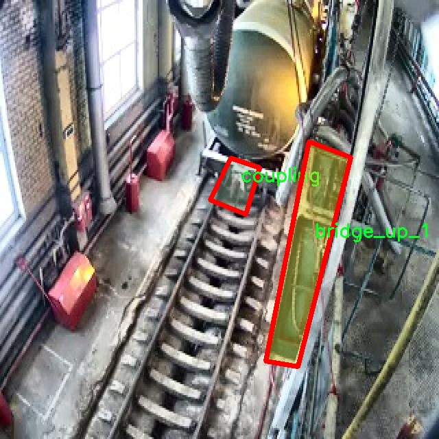

### 1.背景意义

研究背景与意义

随着城市化进程的加快，基础设施的建设与维护变得愈发重要，尤其是桥梁作为交通网络的关键组成部分，其安全性直接关系到公众的生命财产安全。传统的桥梁状态检测方法多依赖人工巡检，这不仅耗时耗力，而且容易受到人为因素的影响，导致检测结果的准确性和一致性不足。因此，开发一种高效、自动化的桥梁状态检测系统显得尤为迫切。

近年来，计算机视觉技术的快速发展为桥梁检测提供了新的解决方案。YOLO（You Only Look Once）系列目标检测算法因其高效性和实时性，已广泛应用于各类视觉识别任务。尤其是YOLOv11的改进版本，进一步提升了检测精度和速度，使其在复杂环境下的应用潜力巨大。通过对桥梁施工场景进行深度学习训练，能够实现对桥梁状态的自动识别与分类，从而提高检测的效率和准确性。

本研究旨在基于改进的YOLOv11算法，构建一个针对轨道施工场景的桥梁状态检测系统。该系统将利用一个包含496张图像的数据集，涵盖9个类别，包括不同状态的桥梁、连接部件及施工人员等。这些类别的划分将帮助系统更精准地识别和评估桥梁的健康状况。通过对数据集的深入分析与模型训练，期望能够实现对桥梁状态的实时监测与预警，进而为桥梁的维护与管理提供科学依据。

此外，随着智能交通系统的不断发展，桥梁状态检测系统的研究不仅具有学术价值，更具备广泛的应用前景。该系统的成功实施将为城市基础设施的智能化管理提供新的思路，推动相关领域的技术进步与创新，最终实现安全、高效的交通环境。

### 2.视频效果

[2.1 视频效果](https://www.bilibili.com/video/BV1dzUnY2Eag/)

### 3.图片效果


##### [项目涉及的源码数据来源链接](https://kdocs.cn/l/cszuIiCKVNis)**

注意：本项目提供训练的数据集和训练教程,由于版本持续更新,暂不提供权重文件（best.pt）,请按照6.训练教程进行训练后实现上图演示的效果。

### 4.数据集信息

##### 4.1 本项目数据集类别数＆类别名

nc: 9
names: ['bridge_down_1', 'bridge_down_2', 'bridge_up_1', 'bridge_up_2', 'coupling', 'no_action', 'person', 'plate_type_1', 'plate_type_2']


该项目为【图像分割】数据集，请在【训练教程和Web端加载模型教程（第三步）】这一步的时候按照【图像分割】部分的教程来训练

##### 4.2 本项目数据集信息介绍

本项目数据集信息介绍

本项目旨在通过改进YOLOv11算法，构建一个高效的轨道施工场景桥梁状态检测系统。为实现这一目标，我们构建了一个专门的数据集，名为“Sibur_project”，该数据集包含了九个类别的标注信息，旨在涵盖桥梁状态检测中的各种重要场景和对象。这九个类别分别为：桥梁下沉状态（bridge_down_1和bridge_down_2）、桥梁上升状态（bridge_up_1和bridge_up_2）、连接件（coupling）、无动作状态（no_action）、行人（person）以及两种类型的板材（plate_type_1和plate_type_2）。这些类别的设计考虑到了实际施工场景中可能出现的各种情况，确保模型能够准确识别和分类不同的桥梁状态。

数据集中的图像样本来源于多种实际施工环境，涵盖了不同的天气条件、光照变化和视角，以增强模型的鲁棒性和适应性。每个类别的样本数量经过精心设计，以确保模型在训练过程中能够获得均衡的学习效果，避免过拟合或偏向某一特定类别。此外，数据集中的标注信息经过严格审核，确保每个样本的标注准确无误，为后续的模型训练提供了可靠的基础。

通过使用该数据集，我们希望能够提升YOLOv11在桥梁状态检测中的性能，使其在实际应用中能够快速、准确地识别和分类桥梁的不同状态，从而为轨道施工的安全性和效率提供有力支持。数据集的构建不仅为模型训练提供了丰富的样本，还为后续的研究和应用奠定了坚实的基础，推动桥梁检测技术的进一步发展。




### 5.全套项目环境部署视频教程（零基础手把手教学）

[5.1 所需软件PyCharm和Anaconda安装教程（第一步）](https://www.bilibili.com/video/BV1BoC1YCEKi/?spm_id_from=333.999.0.0&vd_source=bc9aec86d164b67a7004b996143742dc)


[5.2 安装Python虚拟环境创建和依赖库安装视频教程（第二步）](https://www.bilibili.com/video/BV1ZoC1YCEBw?spm_id_from=333.788.videopod.sections&vd_source=bc9aec86d164b67a7004b996143742dc)

### 6.改进YOLOv11训练教程和Web_UI前端加载模型教程（零基础手把手教学）

[6.1 改进YOLOv11训练教程和Web_UI前端加载模型教程（第三步）](https://www.bilibili.com/video/BV1BoC1YCEhR?spm_id_from=333.788.videopod.sections&vd_source=bc9aec86d164b67a7004b996143742dc)


按照上面的训练视频教程链接加载项目提供的数据集，运行train.py即可开始训练



     Epoch   gpu_mem       box       obj       cls    labels  img_size
     1/200     20.8G   0.01576   0.01955  0.007536        22      1280: 100%|██████████| 849/849 [14:42<00:00,  1.04s/it]
               Class     Images     Labels          P          R     mAP@.5 mAP@.5:.95: 100%|██████████| 213/213 [01:14<00:00,  2.87it/s]
                 all       3395      17314      0.994      0.957      0.0957      0.0843

     Epoch   gpu_mem       box       obj       cls    labels  img_size
     2/200     20.8G   0.01578   0.01923  0.007006        22      1280: 100%|██████████| 849/849 [14:44<00:00,  1.04s/it]
               Class     Images     Labels          P          R     mAP@.5 mAP@.5:.95: 100%|██████████| 213/213 [01:12<00:00,  2.95it/s]
                 all       3395      17314      0.996      0.956      0.0957      0.0845

     Epoch   gpu_mem       box       obj       cls    labels  img_size
     3/200     20.8G   0.01561    0.0191  0.006895        27      1280: 100%|██████████| 849/849 [10:56<00:00,  1.29it/s]
               Class     Images     Labels          P          R     mAP@.5 mAP@.5:.95: 100%|███████   | 187/213 [00:52<00:00,  4.04it/s]
                 all       3395      17314      0.996      0.957      0.0957      0.0845


###### [项目数据集下载链接](https://kdocs.cn/l/cszuIiCKVNis)

### 7.原始YOLOv11算法讲解

YOLOv11是一种由Ultralytics公司开发的最新一代目标检测模型，以其增强的特征提取能力和更高的效率在计算机视觉领域引人注目。该模型在架构上进行了关键升级，通过更新主干和颈部结构，显著提高了对复杂视觉场景的理解和处理精度。YOLOv11不仅在目标检测上表现出色，还支持实例分割、图像分类、姿态估计和定向目标检测（OBB）等任务，展示出其多功能性。

与其前身YOLOv8相比，YOLOv11在设计上实现了深度和宽度的改变，同时引入了几个创新机制。其中，C3k2机制是对YOLOv8中的C2f的改进，提升了浅层特征的处理能力；C2PSA机制则进一步优化了特征图的处理流程。解耦头的创新设计，通过增加两个深度卷积（DWConv），提高了模型对细节的感知能力和分类准确性。

在性能上，YOLOv11m模型在COCO数据集上的平均精度（mAP）提高，并减少了22%的参数量，确保了在运算效率上的突破。该模型可以部署在多种平台上，包括边缘设备、云平台以及支持NVIDIA GPU的系统，彰显出卓越的灵活性和适应性。总体而言，YOLOv11通过一系列的创新突破，对目标检测领域产生了深远的影响，并为未来的开发提供了新的研究方向。


****文档**** ： _ _https://docs.ultralytics.com/models/yolo11/__

****代码链接**** ： _ _https://github.com/ultralytics/ultralytics__

******Performance Metrics******


​ ** **关键特性****

****◆**** ** **增强的特征提取能力**** ：YOLO11采用了改进的主干和颈部架构，增强了 ** **特征提取****
能力，能够实现更精确的目标检测和复杂任务的执行。

****◆**** ** **优化的效率和速度****
：YOLO11引入了精细化的架构设计和优化的训练流程，提供更快的处理速度，并在准确性和性能之间保持最佳平衡。

****◆**** ** **参数更少、精度更高****
：通过模型设计的改进，YOLO11m在COCO数据集上实现了更高的平均精度（mAP），同时使用的参数比YOLOv8m少22%，使其在计算上更加高效，而不牺牲准确性。

****◆**** ** **跨环境的适应性**** ：YOLO11可以无缝部署在各种环境中，包括边缘设备、云平台和支持NVIDIA
GPU的系统，确保最大的灵活性。

****◆**** ** **支持广泛任务****
：无论是目标检测、实例分割、图像分类、姿态估计还是定向目标检测（OBB），YOLO11都旨在应对一系列计算机视觉挑战。

****支持的任务和模式****


​YOLO11建立在YOLOv8中引入的多功能模型范围之上，为各种计算机视觉任务提供增强的支持:


​该表提供了YOLO11模型变体的概述，展示了它们在特定任务中的适用性以及与Inference、Validation、Training和Export等操作模式的兼容性。从实时检测到复杂的分割任务
，这种灵活性使YOLO11适用于计算机视觉的广泛应用。

##### yolov11的创新

■ yolov8 VS yolov11

YOLOv5，YOLOv8和YOLOv11均是ultralytics公司的作品，ultralytics出品必属精品。


​ **具体创新点** ：

**① 深度（depth）和宽度 （width）**

YOLOv8和YOLOv11是基本上完全不同。

**② C3k2机制**

C3k2有参数为c3k，其中在网络的浅层c3k设置为False。C3k2就相当于YOLOv8中的C2f。


​ **③ C2PSA机制**

下图为C2PSA机制的原理图。


​ **④ 解耦头**

解耦头中的分类检测头增加了两个 **DWConv** 。


▲Conv

    
    
    def autopad(k, p=None, d=1):  # kernel, padding, dilation
    
        """Pad to 'same' shape outputs."""
    
        if d > 1:
    
            k = d * (k - 1) + 1 if isinstance(k, int) else [d * (x - 1) + 1 for x in k]  # actual kernel-size
    
        if p is None:
    
            p = k // 2 if isinstance(k, int) else [x // 2 for x in k]  # auto-pad
    
    return p
    
    
    class Conv(nn.Module):
    
        """Standard convolution with args(ch_in, ch_out, kernel, stride, padding, groups, dilation, activation)."""
    
    
        default_act = nn.SiLU()  # default activation
    
    
        def __init__(self, c1, c2, k=1, s=1, p=None, g=1, d=1, act=True):
    
            """Initialize Conv layer with given arguments including activation."""
    
            super().__init__()
    
            self.conv = nn.Conv2d(c1, c2, k, s, autopad(k, p, d), groups=g, dilation=d, bias=False)
    
            self.bn = nn.BatchNorm2d(c2)
    
            self.act = self.default_act if act is True else act if isinstance(act, nn.Module) else nn.Identity()
    
    
        def forward(self, x):
    
            """Apply convolution, batch normalization and activation to input tensor."""
    
            return self.act(self.bn(self.conv(x)))
    
    
        def forward_fuse(self, x):
    
            """Perform transposed convolution of 2D data."""
    
            return self.act(self.conv(x))

▲Conv2d

    
    
    torch.nn.Conv2d(in_channels, out_channels, kernel_size, stride=1, padding=0, dilation=1, groups=1, bias=True, padding_mode='zeros')

▲DWConv

DWConv ** **代表 Depthwise Convolution（深度卷积）****
，是一种在卷积神经网络中常用的高效卷积操作。它主要用于减少计算复杂度和参数量。

    
    
    class DWConv(Conv):
    
        """Depth-wise convolution."""
    
    
        def __init__(self, c1, c2, k=1, s=1, d=1, act=True):  # ch_in, ch_out, kernel, stride, dilation, activation
    
            """Initialize Depth-wise convolution with given parameters."""
    
            super().__init__(c1, c2, k, s, g=math.gcd(c1, c2), d=d, act=act)


### 8.200+种全套改进YOLOV11创新点原理讲解

#### 8.1 200+种全套改进YOLOV11创新点原理讲解大全

由于篇幅限制，每个创新点的具体原理讲解就不全部展开，具体见下列网址中的改进模块对应项目的技术原理博客网址【Blog】（创新点均为模块化搭建，原理适配YOLOv5~YOLOv11等各种版本）

[改进模块技术原理博客【Blog】网址链接](https://gitee.com/qunmasj/good)


#### 8.2 精选部分改进YOLOV11创新点原理讲解

###### 这里节选部分改进创新点展开原理讲解(完整的改进原理见上图和[改进模块技术原理博客链接](https://gitee.com/qunmasj/good)【如果此小节的图加载失败可以通过CSDN或者Github搜索该博客的标题访问原始博客，原始博客图片显示正常】
### RepViT简介

近年来，与轻量级卷积神经网络(cnn)相比，轻量级视觉变压器(ViTs)在资源受限的移动设备上表现出了更高的性能和更低的延迟。这种改进通常归功于多头自注意模块，它使模型能够学习全局表示。然而，轻量级vit和轻量级cnn之间的架构差异还没有得到充分的研究。在这项研究中，我们重新审视了轻量级cnn的高效设计，并强调了它们在移动设备上的潜力。通过集成轻量级vit的高效架构选择，我们逐步增强了标准轻量级CNN的移动友好性，特别是MobileNetV3。这就产生了一个新的纯轻量级cnn家族，即RepViT。大量的实验表明，RepViT优于现有的轻型vit，并在各种视觉任务中表现出良好的延迟。在ImageNet上，RepViT在iPhone 12上以近1ms的延迟实现了超过80%的top-1精度，据我们所知，这是轻量级模型的第一次。

#### RepViT简介
轻量级模型研究一直是计算机视觉任务中的一个焦点，其目标是在降低计算成本的同时达到优秀的性能。轻量级模型与资源受限的移动设备尤其相关，使得视觉模型的边缘部署成为可能。在过去十年中，研究人员主要关注轻量级卷积神经网络（CNNs）的设计，提出了许多高效的设计原则，包括可分离卷积 、逆瓶颈结构 、通道打乱 和结构重参数化等，产生了 MobileNets ，ShuffleNets和 RepVGG 等代表性模型。

另一方面，视觉 Transformers（ViTs）成为学习视觉表征的另一种高效方案。与 CNNs 相比，ViTs 在各种计算机视觉任务中表现出了更优越的性能。然而，ViT 模型一般尺寸很大，延迟很高，不适合资源受限的移动设备。因此，研究人员开始探索 ViT 的轻量级设计。许多高效的ViTs设计原则被提出，大大提高了移动设备上 ViTs 的计算效率，产生了EfficientFormers ，MobileViTs等代表性模型。这些轻量级 ViTs 在移动设备上展现出了相比 CNNs 的更强的性能和更低的延迟。

轻量级 ViTs 优于轻量级 CNNs 的原因通常归结于多头注意力模块，该模块使模型能够学习全局表征。然而，轻量级 ViTs 和轻量级 CNNs 在块结构、宏观和微观架构设计方面存在值得注意的差异，但这些差异尚未得到充分研究。这自然引出了一个问题：轻量级 ViTs 的架构选择能否提高轻量级 CNN 的性能？在这项工作中，我们结合轻量级 ViTs 的架构选择，重新审视了轻量级 CNNs 的设计。我们的旨在缩小轻量级 CNNs 与轻量级 ViTs 之间的差距，并强调前者与后者相比在移动设备上的应用潜力。


在 ConvNeXt 中，参考该博客提出的基于 ResNet50 架构的基础上通过严谨的理论和实验分析，最终设计出一个非常优异的足以媲美 Swin-Transformer 的纯卷积神经网络架构。同样地，RepViT也是主要通过将轻量级 ViTs 的架构设计逐步整合到标准轻量级 CNN，即MobileNetV3-L，来对其进行针对性地改造（魔改）。在这个过程中，作者们考虑了不同粒度级别的设计元素，并通过一系列步骤达到优化的目标。


详细优化步骤如下：

#### 训练配方的对齐
论文中引入了一种衡量移动设备上延迟的指标，并将训练策略与现有的轻量级 ViTs 对齐。这一步骤主要是为了确保模型训练的一致性，其涉及两个概念，即延迟度量和训练策略的调整。

#### 延迟度量指标
为了更准确地衡量模型在真实移动设备上的性能，作者选择了直接测量模型在设备上的实际延迟，以此作为基准度量。这个度量方法不同于之前的研究，它们主要通过FLOPs或模型大小等指标优化模型的推理速度，这些指标并不总能很好地反映在移动应用中的实际延迟。

#### 训练策略的对齐
这里，将 MobileNetV3-L 的训练策略调整以与其他轻量级 ViTs 模型对齐。这包括使用 AdamW 优化器-ViTs 模型必备的优化器，进行 5 个 epoch 的预热训练，以及使用余弦退火学习率调度进行 300 个 epoch 的训练。尽管这种调整导致了模型准确率的略微下降，但可以保证公平性。

#### 块设计的优化
基于一致的训练设置，作者们探索了最优的块设计。块设计是 CNN 架构中的一个重要组成部分，优化块设计有助于提高网络的性能。

#### 分离 Token 混合器和通道混合器
这块主要是对 MobileNetV3-L 的块结构进行了改进，分离了令牌混合器和通道混合器。原来的 MobileNetV3 块结构包含一个 1x1 扩张卷积，然后是一个深度卷积和一个 1x1 的投影层，然后通过残差连接连接输入和输出。在此基础上，RepViT 将深度卷积提前，使得通道混合器和令牌混合器能够被分开。为了提高性能，还引入了结构重参数化来在训练时为深度滤波器引入多分支拓扑。最终，作者们成功地在 MobileNetV3 块中分离了令牌混合器和通道混合器，并将这种块命名为 RepViT 块。

#### 降低扩张比例并增加宽度
在通道混合器中，原本的扩张比例是 4，这意味着 MLP 块的隐藏维度是输入维度的四倍，消耗了大量的计算资源，对推理时间有很大的影响。为了缓解这个问题，我们可以将扩张比例降低到 2，从而减少了参数冗余和延迟，使得 MobileNetV3-L 的延迟降低到 0.65ms。随后，通过增加网络的宽度，即增加各阶段的通道数量，Top-1 准确率提高到 73.5%，而延迟只增加到 0.89ms！

#### 宏观架构元素的优化
在这一步，本文进一步优化了MobileNetV3-L在移动设备上的性能，主要是从宏观架构元素出发，包括 stem，降采样层，分类器以及整体阶段比例。通过优化这些宏观架构元素，模型的性能可以得到显著提高。

#### 浅层网络使用卷积提取器
ViTs 通常使用一个将输入图像分割成非重叠补丁的 “patchify” 操作作为 stem。然而，这种方法在训练优化性和对训练配方的敏感性上存在问题。因此，作者们采用了早期卷积来代替，这种方法已经被许多轻量级 ViTs 所采纳。对比之下，MobileNetV3-L 使用了一个更复杂的 stem 进行 4x 下采样。这样一来，虽然滤波器的初始数量增加到24，但总的延迟降低到0.86ms，同时 top-1 准确率提高到 73.9%。

#### 更深的下采样层
在 ViTs 中，空间下采样通常通过一个单独的补丁合并层来实现。因此这里我们可以采用一个单独和更深的下采样层，以增加网络深度并减少由于分辨率降低带来的信息损失。具体地，作者们首先使用一个 1x1 卷积来调整通道维度，然后将两个 1x1 卷积的输入和输出通过残差连接，形成一个前馈网络。此外，他们还在前面增加了一个 RepViT 块以进一步加深下采样层，这一步提高了 top-1 准确率到 75.4%，同时延迟为 0.96ms。

#### 更简单的分类器
在轻量级 ViTs 中，分类器通常由一个全局平均池化层后跟一个线性层组成。相比之下，MobileNetV3-L 使用了一个更复杂的分类器。因为现在最后的阶段有更多的通道，所以作者们将它替换为一个简单的分类器，即一个全局平均池化层和一个线性层，这一步将延迟降低到 0.77ms，同时 top-1 准确率为 74.8%。

#### 整体阶段比例
阶段比例代表了不同阶段中块数量的比例，从而表示了计算在各阶段中的分布。论文选择了一个更优的阶段比例 1:1:7:1，然后增加网络深度到 2:2:14:2，从而实现了一个更深的布局。这一步将 top-1 准确率提高到 76.9%，同时延迟为 1.02 ms。

#### 卷积核大小的选择
众所周知，CNNs 的性能和延迟通常受到卷积核大小的影响。例如，为了建模像 MHSA 这样的远距离上下文依赖，ConvNeXt 使用了大卷积核，从而实现了显著的性能提升。然而，大卷积核对于移动设备并不友好，因为它的计算复杂性和内存访问成本。MobileNetV3-L 主要使用 3x3 的卷积，有一部分块中使用 5x5 的卷积。作者们将它们替换为3x3的卷积，这导致延迟降低到 1.00ms，同时保持了76.9%的top-1准确率。

#### SE 层的位置
自注意力模块相对于卷积的一个优点是根据输入调整权重的能力，这被称为数据驱动属性。作为一个通道注意力模块，SE层可以弥补卷积在缺乏数据驱动属性上的限制，从而带来更好的性能。MobileNetV3-L 在某些块中加入了SE层，主要集中在后两个阶段。然而，与分辨率较高的阶段相比，分辨率较低的阶段从SE提供的全局平均池化操作中获得的准确率提升较小。作者们设计了一种策略，在所有阶段以交叉块的方式使用SE层，从而在最小的延迟增量下最大化准确率的提升，这一步将top-1准确率提升到77.4%，同时延迟降低到0.87ms。

注意！【这一点其实百度在很早前就已经做过实验比对得到过这个结论了，SE 层放置在靠近深层的地方效果好】

#### 微观设计的调整
RepViT 通过逐层微观设计来调整轻量级 CNN，这包括选择合适的卷积核大小和优化挤压-激励（Squeeze-and-excitation，简称SE）层的位置。这两种方法都能显著改善模型性能。

#### 网络架构
最终，通过整合上述改进策略，我们便得到了模型RepViT的整体架构，该模型有多个变种，例如RepViT-M1/M2/M3。同样地，不同的变种主要通过每个阶段的通道数和块数来区分。


### 9.系统功能展示

图9.1.系统支持检测结果表格显示

  图9.2.系统支持置信度和IOU阈值手动调节

  图9.3.系统支持自定义加载权重文件best.pt(需要你通过步骤5中训练获得)

  图9.4.系统支持摄像头实时识别

  图9.5.系统支持图片识别

  图9.6.系统支持视频识别

  图9.7.系统支持识别结果文件自动保存

  图9.8.系统支持Excel导出检测结果数据


### 10. YOLOv11核心改进源码讲解

#### 10.1 fast_kan_conv.py

以下是对代码中最核心部分的分析和详细注释。主要保留了 `RadialBasisFunction` 和 `FastKANConvNDLayer` 类的实现，因为它们是整个模块的核心。

```python
import torch
import torch.nn as nn

# 定义径向基函数（Radial Basis Function）类
class RadialBasisFunction(nn.Module):
    def __init__(self, grid_min: float = -2., grid_max: float = 2., num_grids: int = 8, denominator: float = None):
        super().__init__()
        # 在指定范围内生成均匀分布的网格点
        grid = torch.linspace(grid_min, grid_max, num_grids)
        # 将网格点设为不可训练的参数
        self.grid = torch.nn.Parameter(grid, requires_grad=False)
        # 设置分母，控制基函数的平滑度
        self.denominator = denominator or (grid_max - grid_min) / (num_grids - 1)

    def forward(self, x):
        # 计算径向基函数的输出
        # 这里使用了高斯函数形式
        return torch.exp(-((x[..., None] - self.grid) / self.denominator) ** 2)

# 定义FastKAN卷积层类
class FastKANConvNDLayer(nn.Module):
    def __init__(self, conv_class, norm_class, input_dim, output_dim, kernel_size,
                 groups=1, padding=0, stride=1, dilation=1,
                 ndim: int = 2, grid_size=8, base_activation=nn.SiLU, grid_range=[-2, 2], dropout=0.0):
        super(FastKANConvNDLayer, self).__init__()
        # 初始化参数
        self.inputdim = input_dim
        self.outdim = output_dim
        self.kernel_size = kernel_size
        self.padding = padding
        self.stride = stride
        self.dilation = dilation
        self.groups = groups
        self.ndim = ndim
        self.grid_size = grid_size
        self.base_activation = base_activation()
        self.grid_range = grid_range

        # 检查参数有效性
        if groups <= 0:
            raise ValueError('groups must be a positive integer')
        if input_dim % groups != 0:
            raise ValueError('input_dim must be divisible by groups')
        if output_dim % groups != 0:
            raise ValueError('output_dim must be divisible by groups')

        # 创建基础卷积层和样条卷积层
        self.base_conv = nn.ModuleList([conv_class(input_dim // groups,
                                                   output_dim // groups,
                                                   kernel_size,
                                                   stride,
                                                   padding,
                                                   dilation,
                                                   groups=1,
                                                   bias=False) for _ in range(groups)])

        self.spline_conv = nn.ModuleList([conv_class(grid_size * input_dim // groups,
                                                     output_dim // groups,
                                                     kernel_size,
                                                     stride,
                                                     padding,
                                                     dilation,
                                                     groups=1,
                                                     bias=False) for _ in range(groups)])

        # 创建层归一化层
        self.layer_norm = nn.ModuleList([norm_class(output_dim // groups) for _ in range(groups)])

        # 初始化径向基函数
        self.rbf = RadialBasisFunction(grid_range[0], grid_range[1], grid_size)

        # 初始化丢弃层
        self.dropout = None
        if dropout > 0:
            if ndim == 1:
                self.dropout = nn.Dropout1d(p=dropout)
            if ndim == 2:
                self.dropout = nn.Dropout2d(p=dropout)
            if ndim == 3:
                self.dropout = nn.Dropout3d(p=dropout)

        # 使用Kaiming均匀分布初始化卷积层权重
        for conv_layer in self.base_conv:
            nn.init.kaiming_uniform_(conv_layer.weight, nonlinearity='linear')

        for conv_layer in self.spline_conv:
            nn.init.kaiming_uniform_(conv_layer.weight, nonlinearity='linear')

    def forward_fast_kan(self, x, group_index):
        # 快速KAN前向传播
        # 对输入应用基础激活函数并进行线性变换
        base_output = self.base_conv[group_index](self.base_activation(x))
        if self.dropout is not None:
            x = self.dropout(x)
        # 计算样条基函数
        spline_basis = self.rbf(self.layer_norm[group_index](x))
        spline_basis = spline_basis.moveaxis(-1, 2).flatten(1, 2)
        # 应用样条卷积
        spline_output = self.spline_conv[group_index](spline_basis)
        # 合并基础输出和样条输出
        x = base_output + spline_output

        return x

    def forward(self, x):
        # 前向传播，处理多个组
        split_x = torch.split(x, self.inputdim // self.groups, dim=1)
        output = []
        for group_ind, _x in enumerate(split_x):
            y = self.forward_fast_kan(_x.clone(), group_ind)
            output.append(y.clone())
        # 将所有组的输出拼接在一起
        y = torch.cat(output, dim=1)
        return y
```

### 代码核心部分说明：
1. **径向基函数 (RadialBasisFunction)**: 该类用于生成径向基函数，主要用于对输入进行平滑处理。它的输出是基于输入和预定义网格点的高斯函数值。

2. **FastKAN卷积层 (FastKANConvNDLayer)**: 该类实现了一个自定义的卷积层，支持多维卷积。它包括基础卷积、样条卷积和层归一化。通过对输入进行分组处理，可以提高计算效率。

3. **前向传播**: `forward_fast_kan` 方法实现了快速的前向传播逻辑，结合了基础卷积和样条卷积的输出。

以上代码是一个复杂的卷积神经网络模块的核心部分，主要用于处理多维数据，适用于深度学习任务。

这个文件定义了一个名为 `fast_kan_conv.py` 的 PyTorch 模块，主要实现了一种快速的卷积神经网络层，称为 FastKANConv。该模块包括多个类，分别用于不同维度的卷积操作（1D、2D 和 3D），并结合了径向基函数（Radial Basis Function, RBF）来增强卷积的表现。

首先，`RadialBasisFunction` 类定义了一个径向基函数层。它在初始化时接受一些参数，包括网格的最小值和最大值、网格的数量以及分母（用于控制基函数的平滑度）。在 `forward` 方法中，输入 `x` 会与网格进行计算，返回一个经过 RBF 变换的输出。

接下来，`FastKANConvNDLayer` 类是一个通用的卷积层，支持任意维度的卷积操作。它在初始化时接收多个参数，包括输入和输出的维度、卷积核大小、分组数、填充、步幅、扩张率等。该类首先检查输入的有效性，然后创建基本卷积层、样条卷积层和归一化层。基本卷积层使用指定的卷积类（如 `nn.Conv1d`、`nn.Conv2d` 或 `nn.Conv3d`），而样条卷积层则使用 RBF 生成的基函数作为输入。权重初始化采用 Kaiming 均匀分布，以帮助网络更好地训练。

`forward_fast_kan` 方法实现了快速的卷积计算。它首先对输入应用基本激活函数，然后通过基本卷积层进行线性变换。接着，如果使用了 dropout，则对输入进行 dropout 处理。然后，通过归一化层和 RBF 计算样条基函数，并将其传递给样条卷积层。最后，将基本卷积输出和样条卷积输出相加，得到最终结果。

`forward` 方法将输入张量按组分割，然后对每个组调用 `forward_fast_kan` 方法，最后将所有组的输出拼接在一起。

此外，文件中还定义了三个具体的卷积层类：`FastKANConv1DLayer`、`FastKANConv2DLayer` 和 `FastKANConv3DLayer`，分别用于一维、二维和三维卷积。这些类继承自 `FastKANConvNDLayer`，并在初始化时指定了相应的卷积和归一化类。

总体而言，这个模块提供了一种灵活且高效的卷积层实现，结合了径向基函数和多维卷积操作，适用于各种深度学习任务。

#### 10.2 metaformer.py

以下是经过简化并添加详细中文注释的核心代码部分：

```python
import torch
import torch.nn as nn
import torch.nn.functional as F

class Scale(nn.Module):
    """
    按元素乘法缩放向量。
    """
    def __init__(self, dim, init_value=1.0, trainable=True):
        super().__init__()
        # 初始化可训练的缩放参数
        self.scale = nn.Parameter(init_value * torch.ones(dim), requires_grad=trainable)

    def forward(self, x):
        # 将输入x按元素乘以缩放参数
        return x * self.scale

class MF_Attention(nn.Module):
    """
    自注意力机制的实现，源自Transformer。
    """
    def __init__(self, dim, head_dim=32, num_heads=None, qkv_bias=False,
                 attn_drop=0., proj_drop=0., proj_bias=False):
        super().__init__()

        self.head_dim = head_dim
        self.scale = head_dim ** -0.5  # 缩放因子

        # 计算头的数量
        self.num_heads = num_heads if num_heads else dim // head_dim
        if self.num_heads == 0:
            self.num_heads = 1
        
        self.attention_dim = self.num_heads * self.head_dim

        # 定义Q、K、V的线性变换
        self.qkv = nn.Linear(dim, self.attention_dim * 3, bias=qkv_bias)
        self.attn_drop = nn.Dropout(attn_drop)  # 注意力丢弃层
        self.proj = nn.Linear(self.attention_dim, dim, bias=proj_bias)  # 投影层
        self.proj_drop = nn.Dropout(proj_drop)  # 投影丢弃层

    def forward(self, x):
        B, H, W, C = x.shape  # 获取输入的形状
        N = H * W  # 计算总的序列长度
        # 计算Q、K、V
        qkv = self.qkv(x).reshape(B, N, 3, self.num_heads, self.head_dim).permute(2, 0, 3, 1, 4)
        q, k, v = qkv.unbind(0)  # 将Q、K、V分开

        # 计算注意力权重
        attn = (q @ k.transpose(-2, -1)) * self.scale
        attn = attn.softmax(dim=-1)  # 应用softmax
        attn = self.attn_drop(attn)  # 应用注意力丢弃

        # 计算输出
        x = (attn @ v).transpose(1, 2).reshape(B, H, W, self.attention_dim)
        x = self.proj(x)  # 投影
        x = self.proj_drop(x)  # 应用投影丢弃
        return x

class MetaFormerBlock(nn.Module):
    """
    MetaFormer块的实现。
    """
    def __init__(self, dim,
                 token_mixer=nn.Identity, mlp=Mlp,
                 norm_layer=partial(LayerNormWithoutBias, eps=1e-6),
                 drop=0., drop_path=0.,
                 layer_scale_init_value=None, res_scale_init_value=None):

        super().__init__()

        self.norm1 = norm_layer(dim)  # 第一层归一化
        self.token_mixer = token_mixer(dim=dim, drop=drop)  # 令牌混合器
        self.drop_path1 = DropPath(drop_path) if drop_path > 0. else nn.Identity()  # 丢弃路径
        self.layer_scale1 = Scale(dim=dim, init_value=layer_scale_init_value) if layer_scale_init_value else nn.Identity()  # 层缩放
        self.res_scale1 = Scale(dim=dim, init_value=res_scale_init_value) if res_scale_init_value else nn.Identity()  # 残差缩放

        self.norm2 = norm_layer(dim)  # 第二层归一化
        self.mlp = mlp(dim=dim, drop=drop)  # MLP
        self.drop_path2 = DropPath(drop_path) if drop_path > 0. else nn.Identity()  # 丢弃路径
        self.layer_scale2 = Scale(dim=dim, init_value=layer_scale_init_value) if layer_scale_init_value else nn.Identity()  # 层缩放
        self.res_scale2 = Scale(dim=dim, init_value=res_scale_init_value) if res_scale_init_value else nn.Identity()  # 残差缩放
        
    def forward(self, x):
        # 前向传播
        x = x.permute(0, 2, 3, 1)  # 调整维度顺序
        x = self.res_scale1(x) + \
            self.layer_scale1(
                self.drop_path1(
                    self.token_mixer(self.norm1(x))
                )
            )
        x = self.res_scale2(x) + \
            self.layer_scale2(
                self.drop_path2(
                    self.mlp(self.norm2(x))
                )
            )
        return x.permute(0, 3, 1, 2)  # 恢复维度顺序
```

### 代码说明：
1. **Scale类**：用于实现可训练的缩放参数。
2. **MF_Attention类**：实现了自注意力机制，包含Q、K、V的计算和注意力权重的应用。
3. **MetaFormerBlock类**：实现了MetaFormer块，包含两个归一化层、一个令牌混合器和一个MLP，支持残差连接和缩放。

这些类是实现MetaFormer架构的核心组件，提供了自注意力机制和块的结构。

这个程序文件 `metaformer.py` 实现了一些与 MetaFormer 相关的深度学习模块，主要用于构建神经网络架构，特别是在计算机视觉任务中。文件中定义了多个类，每个类代表一种特定的功能或模块。

首先，文件导入了一些必要的库，包括 `torch` 和 `torch.nn`，这些是 PyTorch 的核心库，用于构建和训练神经网络。`functools.partial` 用于创建部分应用的函数，`timm.layers` 中的一些工具函数也被引入。

文件中的主要类包括：

1. **Scale**：这个类用于按元素乘以一个可训练的缩放向量。它的构造函数接受维度、初始值和是否可训练的标志。

2. **SquaredReLU** 和 **StarReLU**：这两个类实现了不同的激活函数。SquaredReLU 是 ReLU 的平方，而 StarReLU 则在 ReLU 的基础上增加了可学习的缩放和偏置。

3. **MF_Attention**：实现了经典的自注意力机制，主要用于 Transformer 模型。它通过线性变换生成查询、键和值，并计算注意力权重。

4. **RandomMixing**：这个类生成一个随机混合矩阵，并将输入数据进行混合。它通过矩阵乘法实现对输入的随机重排列。

5. **LayerNormGeneral** 和 **LayerNormWithoutBias**：这两个类实现了不同形式的层归一化，前者提供了更灵活的参数设置，后者则是一个更快的实现，专门用于没有偏置的情况。

6. **SepConv**：实现了反向可分离卷积，主要用于降低计算复杂度，同时保持模型的表达能力。

7. **Pooling**：实现了一种特定的池化操作，主要用于 PoolFormer 模型。

8. **Mlp**：实现了多层感知机（MLP），常用于 MetaFormer 模型中的特征转换。

9. **ConvolutionalGLU**：实现了一种卷积门控线性单元（GLU），用于特征提取和转换。

10. **MetaFormerBlock** 和 **MetaFormerCGLUBlock**：这两个类实现了 MetaFormer 的基本模块，分别使用不同的特征混合和 MLP 结构。它们包含归一化、特征混合、DropPath 和缩放等操作。

整体来看，这个文件实现了多种深度学习组件，旨在构建高效的 MetaFormer 模型，适用于各种视觉任务。每个模块都经过精心设计，以便在网络中灵活组合，从而实现更强的性能和更好的可扩展性。

#### 10.3 fadc.py

以下是代码中最核心的部分，并附上详细的中文注释：

```python
import torch
import torch.nn as nn
import torch.nn.functional as F

class OmniAttention(nn.Module):
    def __init__(self, in_planes, out_planes, kernel_size, groups=1, reduction=0.0625, kernel_num=4, min_channel=16):
        super(OmniAttention, self).__init__()
        # 计算注意力通道数
        attention_channel = max(int(in_planes * reduction), min_channel)
        self.kernel_size = kernel_size
        self.kernel_num = kernel_num
        self.temperature = 1.0  # 温度参数，用于控制注意力的平滑程度

        # 定义用于计算通道注意力的层
        self.avgpool = nn.AdaptiveAvgPool2d(1)  # 自适应平均池化
        self.fc = nn.Conv2d(in_planes, attention_channel, 1, bias=False)  # 全连接层
        self.bn = nn.BatchNorm2d(attention_channel)  # 批归一化
        self.relu = nn.ReLU(inplace=True)  # ReLU激活函数

        # 定义通道注意力的输出层
        self.channel_fc = nn.Conv2d(attention_channel, in_planes, 1, bias=True)

        # 根据输入和输出通道数决定过滤器注意力的计算方式
        if in_planes == groups and in_planes == out_planes:  # 深度可分离卷积
            self.func_filter = self.skip
        else:
            self.filter_fc = nn.Conv2d(attention_channel, out_planes, 1, bias=True)
            self.func_filter = self.get_filter_attention

        # 根据卷积核大小决定空间注意力的计算方式
        if kernel_size == 1:  # 点卷积
            self.func_spatial = self.skip
        else:
            self.spatial_fc = nn.Conv2d(attention_channel, kernel_size * kernel_size, 1, bias=True)
            self.func_spatial = self.get_spatial_attention

        # 根据卷积核数量决定核注意力的计算方式
        if kernel_num == 1:
            self.func_kernel = self.skip
        else:
            self.kernel_fc = nn.Conv2d(attention_channel, kernel_num, 1, bias=True)
            self.func_kernel = self.get_kernel_attention

        self._initialize_weights()  # 初始化权重

    def _initialize_weights(self):
        # 权重初始化
        for m in self.modules():
            if isinstance(m, nn.Conv2d):
                nn.init.kaiming_normal_(m.weight, mode='fan_out', nonlinearity='relu')
                if m.bias is not None:
                    nn.init.constant_(m.bias, 0)
            if isinstance(m, nn.BatchNorm2d):
                nn.init.constant_(m.weight, 1)
                nn.init.constant_(m.bias, 0)

    def get_channel_attention(self, x):
        # 计算通道注意力
        channel_attention = torch.sigmoid(self.channel_fc(x).view(x.size(0), -1, 1, 1) / self.temperature)
        return channel_attention

    def get_filter_attention(self, x):
        # 计算过滤器注意力
        filter_attention = torch.sigmoid(self.filter_fc(x).view(x.size(0), -1, 1, 1) / self.temperature)
        return filter_attention

    def get_spatial_attention(self, x):
        # 计算空间注意力
        spatial_attention = self.spatial_fc(x).view(x.size(0), 1, 1, 1, self.kernel_size, self.kernel_size)
        spatial_attention = torch.sigmoid(spatial_attention / self.temperature)
        return spatial_attention

    def get_kernel_attention(self, x):
        # 计算核注意力
        kernel_attention = self.kernel_fc(x).view(x.size(0), -1, 1, 1, 1, 1)
        kernel_attention = F.softmax(kernel_attention / self.temperature, dim=1)
        return kernel_attention

    def forward(self, x):
        # 前向传播
        x = self.avgpool(x)  # 自适应平均池化
        x = self.fc(x)  # 全连接层
        x = self.bn(x)  # 批归一化
        x = self.relu(x)  # ReLU激活
        return self.func_channel(x), self.func_filter(x), self.func_spatial(x), self.func_kernel(x)  # 返回各类注意力

class AdaptiveDilatedConv(nn.Module):
    """自适应膨胀卷积类，封装了可调变形卷积层"""

    def __init__(self, in_channels, out_channels, kernel_size, stride=1, padding=0, dilation=1, groups=1, bias=True):
        super(AdaptiveDilatedConv, self).__init__()
        # 初始化卷积层参数
        self.conv = nn.Conv2d(in_channels, out_channels, kernel_size, stride=stride, padding=padding, dilation=dilation, groups=groups, bias=bias)
        self.omni_attention = OmniAttention(in_planes=in_channels, out_planes=out_channels, kernel_size=kernel_size)  # 初始化OmniAttention

    def forward(self, x):
        # 前向传播
        attention_outputs = self.omni_attention(x)  # 计算注意力
        x = self.conv(x)  # 进行卷积操作
        # 将注意力与卷积结果结合
        return x * attention_outputs[0]  # 这里假设使用通道注意力

# 以上是代码的核心部分，包含了OmniAttention类和AdaptiveDilatedConv类的实现。
```

### 代码说明：
1. **OmniAttention类**：实现了多种注意力机制，包括通道注意力、过滤器注意力、空间注意力和核注意力。通过自适应平均池化和全连接层计算注意力权重，并通过sigmoid或softmax激活函数输出。

2. **AdaptiveDilatedConv类**：封装了可调变形卷积层，结合了自适应膨胀卷积和OmniAttention的注意力机制。前向传播中，首先计算注意力，然后进行卷积操作，最后将注意力与卷积结果结合。

这段代码主要用于深度学习中的卷积神经网络，特别是在图像处理和计算机视觉任务中。

这个程序文件 `fadc.py` 实现了一些用于深度学习的模块，主要包括自适应膨胀卷积、频率选择和全局注意力机制等。文件中使用了 PyTorch 库，定义了多个类和函数，下面对其主要内容进行说明。

首先，文件引入了必要的库，包括 `torch` 和 `torch.nn`，并尝试从 `mmcv` 中导入 `ModulatedDeformConv2d`，如果导入失败，则将其替换为 `nn.Module`。这表明该代码可能依赖于某些特定的模块或库。

接下来，定义了 `OmniAttention` 类，这是一个实现全局注意力机制的模块。它通过自适应平均池化、全连接层和批归一化等操作来计算通道注意力、滤波器注意力、空间注意力和核注意力。这个类的初始化方法中定义了多个卷积层和激活函数，并在 `_initialize_weights` 方法中初始化了这些层的权重。

然后，定义了 `generate_laplacian_pyramid` 函数，用于生成拉普拉斯金字塔。这一过程通过逐层下采样输入张量来提取不同尺度的特征，并可以选择是否对输出进行尺寸对齐。

接下来是 `FrequencySelection` 类，它用于选择频率特征。该类支持多种操作模式，包括通过平均池化、拉普拉斯金字塔或频率选择来提取特征。它还支持全局选择机制，可以在频域上进行操作。

随后，定义了 `AdaptiveDilatedConv` 类，它是一个封装了可调变形卷积的模块。这个类继承自 `ModulatedDeformConv2d`，并在其初始化中设置了偏移量、卷积类型和频率选择等参数。该类的 `forward` 方法实现了自适应卷积的前向传播逻辑，结合了注意力机制和频率选择。

最后，定义了 `AdaptiveDilatedDWConv` 类，这是一个深度可分离卷积的实现，支持与 `AdaptiveDilatedConv` 类似的功能。它同样使用了注意力机制和频率选择，能够处理不同的输入通道。

整体来看，这个文件实现了复杂的卷积操作和注意力机制，适用于需要高效特征提取和处理的深度学习任务，尤其是在计算机视觉领域。代码中包含了大量的注释和参数设置，方便用户根据需求进行调整和使用。

#### 10.4 hcfnet.py

以下是代码中最核心的部分，并对其进行了详细的中文注释：

```python
import torch
import torch.nn as nn
import torch.nn.functional as F

class SpatialAttentionModule(nn.Module):
    def __init__(self):
        super(SpatialAttentionModule, self).__init__()
        # 定义一个卷积层，用于生成空间注意力图
        self.conv2d = nn.Conv2d(in_channels=2, out_channels=1, kernel_size=7, stride=1, padding=3)
        self.sigmoid = nn.Sigmoid()  # 使用Sigmoid激活函数将输出归一化到[0, 1]

    def forward(self, x):
        # 计算输入特征图的平均值和最大值
        avgout = torch.mean(x, dim=1, keepdim=True)  # 在通道维度上求平均
        maxout, _ = torch.max(x, dim=1, keepdim=True)  # 在通道维度上求最大值
        out = torch.cat([avgout, maxout], dim=1)  # 将平均值和最大值拼接在一起
        out = self.sigmoid(self.conv2d(out))  # 通过卷积层和Sigmoid激活函数
        return out * x  # 将注意力图与输入特征图相乘，得到加权后的特征图

class PPA(nn.Module):
    def __init__(self, in_features, filters) -> None:
        super().__init__()
        # 定义各个卷积层和注意力模块
        self.skip = nn.Conv2d(in_features, filters, kernel_size=1, stride=1)  # 跳跃连接
        self.c1 = nn.Conv2d(filters, filters, kernel_size=3, padding=1)
        self.c2 = nn.Conv2d(filters, filters, kernel_size=3, padding=1)
        self.c3 = nn.Conv2d(filters, filters, kernel_size=3, padding=1)
        self.sa = SpatialAttentionModule()  # 空间注意力模块
        self.drop = nn.Dropout2d(0.1)  # Dropout层
        self.bn1 = nn.BatchNorm2d(filters)  # 批归一化
        self.silu = nn.SiLU()  # SiLU激活函数

    def forward(self, x):
        # 通过各个卷积层和注意力模块进行前向传播
        x_skip = self.skip(x)  # 跳跃连接
        x1 = self.c1(x)  # 第一层卷积
        x2 = self.c2(x1)  # 第二层卷积
        x3 = self.c3(x2)  # 第三层卷积
        # 将各个特征图相加
        x = x1 + x2 + x3 + x_skip
        x = self.sa(x)  # 应用空间注意力模块
        x = self.drop(x)  # 应用Dropout
        x = self.bn1(x)  # 批归一化
        x = self.silu(x)  # SiLU激活
        return x  # 返回最终的特征图

class DASI(nn.Module):
    def __init__(self, in_features, out_features) -> None:
        super().__init__()
        # 定义各个卷积层和跳跃连接
        self.tail_conv = nn.Conv2d(out_features, out_features, kernel_size=1)
        self.conv = nn.Conv2d(out_features // 2, out_features // 4, kernel_size=1)
        self.bns = nn.BatchNorm2d(out_features)
        self.skips = nn.Conv2d(in_features[1], out_features, kernel_size=1)
        self.skips_2 = nn.Conv2d(in_features[0], out_features, kernel_size=1)
        self.skips_3 = nn.Conv2d(in_features[2], out_features, kernel_size=3, stride=2, dilation=2, padding=2)
        self.silu = nn.SiLU()  # SiLU激活函数

    def forward(self, x_list):
        # 将输入特征图分解为高、中、低分辨率特征图
        x_low, x, x_high = x_list
        x_high = self.skips_3(x_high) if x_high is not None else None  # 处理高分辨率特征图
        x_low = self.skips_2(x_low) if x_low is not None else None  # 处理低分辨率特征图
        x = self.skips(x)  # 处理中分辨率特征图
        x_skip = x  # 保存跳跃连接的特征图
        x = torch.chunk(x, 4, dim=1)  # 将特征图分成4个部分

        # 处理不同分辨率的特征图并进行加权
        if x_high is None:
            x0 = self.conv(torch.cat((x[0], x_low[0]), dim=1)) if x_low is not None else self.conv(x[0])
            x1 = self.conv(torch.cat((x[1], x_low[1]), dim=1)) if x_low is not None else self.conv(x[1])
            x2 = self.conv(torch.cat((x[2], x_low[2]), dim=1)) if x_low is not None else self.conv(x[2])
            x3 = self.conv(torch.cat((x[3], x_low[3]), dim=1)) if x_low is not None else self.conv(x[3])
        else:
            x0 = self.conv(torch.cat((x[0], x_high[0]), dim=1))
            x1 = self.conv(torch.cat((x[1], x_high[1]), dim=1))
            x2 = self.conv(torch.cat((x[2], x_high[2]), dim=1))
            x3 = self.conv(torch.cat((x[3], x_high[3]), dim=1))

        x = torch.cat((x0, x1, x2, x3), dim=1)  # 将处理后的特征图拼接
        x = self.tail_conv(x)  # 通过尾部卷积层
        x += x_skip  # 加上跳跃连接
        x = self.bns(x)  # 批归一化
        x = self.silu(x)  # SiLU激活
        return x  # 返回最终的特征图
```

### 代码核心部分解释：
1. **SpatialAttentionModule**：实现了空间注意力机制，通过计算输入特征图的平均值和最大值来生成注意力图，并与输入特征图相乘以增强重要特征。
  
2. **PPA**：主要是一个特征提取模块，包含多个卷积层和空间注意力模块，旨在提取多层次的特征并通过跳跃连接保留信息。

3. **DASI**：处理不同分辨率的特征图，通过跳跃连接和卷积层进行特征融合，最终输出经过处理的特征图。

这个程序文件 `hcfnet.py` 定义了一些用于深度学习的模块，主要是针对图像处理和特征提取的网络结构。文件中包含多个类，每个类实现了特定的功能。

首先，`SpatialAttentionModule` 类实现了空间注意力机制。它通过对输入特征图进行平均池化和最大池化，生成两个特征图，然后将它们拼接在一起，经过一个卷积层和 Sigmoid 激活函数，最终生成一个注意力权重图。这个权重图与输入特征图相乘，从而强调重要的空间特征。

接下来是 `LocalGlobalAttention` 类，它结合了局部和全局的注意力机制。该类首先将输入特征图划分为小块（patches），然后对每个小块进行处理，使用多层感知机（MLP）来生成局部特征。通过计算余弦相似度，生成一个掩码并与局部特征相乘，进一步提取有用的信息。最后，经过上采样和卷积操作，输出特征图。

`ECA` 类实现了有效的通道注意力机制。它通过自适应平均池化生成特征，并使用一维卷积来学习通道之间的关系。通过 Sigmoid 激活函数，生成的权重与输入特征图相乘，从而调整通道的重要性。

`PPA` 类是一个更复杂的模块，整合了多个子模块，包括跳跃连接、卷积层、空间注意力和局部全局注意力。它通过多个卷积层对输入进行处理，并结合不同的特征，最终输出经过归一化和激活函数处理的特征图。

`Bag` 类实现了一个简单的加权机制，通过计算边缘注意力，将输入特征与另一特征进行加权融合。

最后，`DASI` 类是一个更高层次的模块，负责将不同尺度的特征进行融合。它使用多个卷积层和跳跃连接，处理高、中、低分辨率的特征图，并通过 `Bag` 类进行加权融合。最终，输出经过归一化和激活函数处理的特征图。

整体来看，这个文件实现了一些先进的注意力机制和特征融合策略，适用于图像分类、目标检测等计算机视觉任务。通过组合不同的模块，可以有效地提取和增强图像中的重要特征。

### 11.完整训练+Web前端界面+200+种全套创新点源码、数据集获取


# [下载链接：https://mbd.pub/o/bread/Z5eUkp1v](https://mbd.pub/o/bread/Z5eUkp1v)